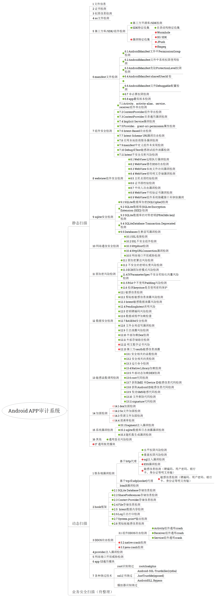

# Android应用审计checklist整理
在对一个Android应用做安全审计分析的时候，可以从静态、动态2个方面去做安全分析，下面是我整理的常规漏洞的checklist，欢迎大家补充。

## 一、静态扫描

### 1 文件信息

### 2 证书检测

### 3 权限信息检测

### 4 so文件检测

### 5 第三方库/SDK/组件检测
* 第三方开源库/SDK检测

### 6 manifest文件检测
* 6.1 [AndroidManifest文件中PermissionGroup检测](http://01hackcode.com/wiki/6.1)
* 6.2 [AndroidManifest文件中系统权限使用检测](http://01hackcode.com/wiki/6.2)
* 6.3 [AndroidManifest危险ProtectionLevel权限检测](http://01hackcode.com/wiki/6.3)
* 6.4 [AndroidManifest sharedUserId 检测](http://01hackcode.com/wiki/6.4)
* 6.5 [AndroidManifest allowBackup标志检测](http://01hackcode.com/wiki/6.5)
* 6.6 [AndroidManifest文件Debuggable配置检测](http://01hackcode.com/wiki/6.6)
* 6.7 [非必要权限检测](http://01hackcode.com/wiki/6.7)
* 6.8 [app最低版本检测](http://01hackcode.com/wiki/6.8)

### 7 组件安全检测
* 7.1 [Activity、activity-alias、service、receiver组件导出检测](http://01hackcode.com/wiki/7.1)
* 7.2 [ContentProvider组件导出检测](http://01hackcode.com/wiki/7.2)
* 7.3 [ContentProvider目录遍历漏洞检测](http://01hackcode.com/wiki/7.3)
* 7.4 [Implicit Service漏洞检测](http://01hackcode.com/wiki/7.4)
* 7.5 [Provider：grant-uri-permission属性检测](http://01hackcode.com/wiki/7.5)
* 7.6 [Intent-Based攻击检测](http://01hackcode.com/wiki/7.6)
* 7.7 [Intent Scheme URI漏洞攻击检测](http://01hackcode.com/wiki/7.7)
* 7.8 [应用本地拒绝服务漏洞检测](http://01hackcode.com/wiki/7.8)
* 7.9 [manifest中定义组件未实现检测](http://01hackcode.com/wiki/7.9)
* 7.10 [Debug或Test敏感测试组件泄露检测](http://01hackcode.com/wiki/7.10)
* 7.11 [Intent不安全反射风险检测](http://01hackcode.com/wiki/7.11)

### 8 webview组件安全检测
* 8.1 [WebView远程执行漏洞检测](http://01hackcode.com/wiki/8.1)
* 8.2 [WebView潜在XSS攻击检测](http://01hackcode.com/wiki/8.2)
* 8.3 [WebView本地文件访问漏洞检测](http://01hackcode.com/wiki/8.3)
* 8.4 [WebView密码明文存储漏洞检测](http://01hackcode.com/wiki/8.4)
* 8.5 [主机名弱校验检测](http://01hackcode.com/wiki/8.5)
* 8.6 [证书弱校验检测](http://01hackcode.com/wiki/8.6)
* 8.7 [中间人攻击漏洞检测](http://01hackcode.com/wiki/8.7)
* 8.8 [WebView不校验证书漏洞检测](http://01hackcode.com/wiki/8.8)
* 8.9 [WebView组件系统隐藏接口未移除漏洞](http://01hackcode.com/wiki/8.9)

### 9 sqlite安全检测
* 9.1 [SQLite数据库加密(SQLCipher)检测](http://01hackcode.com/wiki/9.1)
* 9.2 [SQLite数据库(SQLite Encryption Extension (SEE)) 检测](http://01hackcode.com/wiki/9.2)
* 9.3 [SQLite数据库的对称密钥(PRAGMA key) 检测](http://01hackcode.com/wiki/9.3)
* 9.4 [SQLiteDatabase Transaction Deprecated检测](http://01hackcode.com/wiki/9.4)
* 9.5 [Databases任意读写漏洞检测](http://01hackcode.com/wiki/9.5)

### 10 网络通信安全检测
* 10.1 [SSL连接检测](http://01hackcode.com/wiki/10.1)
* 10.2 [SSL不安全组件检测](http://01hackcode.com/wiki/10.2)
* 10.3 [HttpHost检测](http://01hackcode.com/wiki/10.3)
* 10.4 [HttpURLConnection漏洞检测](http://01hackcode.com/wiki/10.4)
* 10.5 [网络端口开放威胁检测](http://01hackcode.com/wiki/10.5)

### 11 弱加密风险检测
* 11.1 [弱加密算法风险检测](http://01hackcode.com/wiki/11.1)
* 11.2 [不安全的密钥长度风险检测](http://01hackcode.com/wiki/11.2)
* 11.3 [ECB弱加密模式风险检测](http://01hackcode.com/wiki/11.3)
* 11.4 [IVParameterSpec不安全初始化向量风险检测](http://01hackcode.com/wiki/11.4)
* 11.5 [RSA中不使用Padding风险检测](http://01hackcode.com/wiki/11.5)
* 11.6 [检测keystore是否使用密码保护](http://01hackcode.com/wiki/11.6)

### 12 数据安全检测
* 12.1 [敏感信息检测](http://01hackcode.com/wiki/12.1)
* 12.2 [剪贴板敏感信息泄露风险检测](http://01hackcode.com/wiki/12.2)
* 12.3 [Intent敏感数据泄露风险检测](http://01hackcode.com/wiki/12.3)
* 12.4 [PendingIntent误用风险](http://01hackcode.com/wiki/12.4)
* 12.5 [密钥硬编码风险检测](http://01hackcode.com/wiki/12.5)
* 12.6 [数据或程序加载检查](http://01hackcode.com/wiki/12.6)
* 12.7 [BASE64安全检测](http://01hackcode.com/wiki/12.7)
* 12.8 [文件全局读写漏洞检测](http://01hackcode.com/wiki/12.8)
* 12.9 [日志泄露风险检测](http://01hackcode.com/wiki/12.9)
* 12.10 [外部加载Dex检测](http://01hackcode.com/wiki/12.10)
* 12.11 [外部存储路径检测](http://01hackcode.com/wiki/12.11)
* 12.12 [明文数字证书风险](http://01hackcode.com/wiki/12.12)
* 12.13 [第三方oauth敏感信息泄露](http://01hackcode.com/wiki/12.13)

### 13 敏感函数调用检测
* 13.1 [安全相关的函数检测](http://01hackcode.com/wiki/13.1)
* 13.2 [安全相关的类检测](http://01hackcode.com/wiki/13.2)
* 13.3 [运行命令检测](http://01hackcode.com/wiki/13.3)
* 13.4 [Native Library加载检测](http://01hackcode.com/wiki/13.4)
* 13.5 [外部动态加载DEX检测](http://01hackcode.com/wiki/13.5)
* 13.6 [root代码检测](http://01hackcode.com/wiki/13.6)
* 13.7 [获取IMEI 和Device ID敏感信息代码检测](http://01hackcode.com/wiki/13.7)
* 13.8 [获取Android ID敏感信息代码检测](http://01hackcode.com/wiki/13.8)
* 13.9 [发送SMS敏感代码检测](http://01hackcode.com/wiki/13.9)
* 13.10 [文件删除代码检测](http://01hackcode.com/wiki/13.10)
* 13.11 [signature代码检测](http://01hackcode.com/wiki/13.11)

### 14 加固检测
* 14.1 dex加固检测
* 14.2 So文件加固检测
* 14.3 资源文件加固检测
* 14.4 混淆率检测

### 15 系统漏洞检测
* 15.1 fragment注入漏洞检测
* 15.2 sqlite数据库日志泄露漏洞检测
* 15.3 随机数生成漏洞检测

### 16 其他
* 通用签名风险检测

## 二、动态扫描
* 1 服务端漏洞检测
    * 基于http代理
        * 水平权限风险检测
        * 垂直权限风险检测
        * sql注入漏洞检测
        * XSS漏洞检测
        * 敏感信息检测（硬编码、用户密码、银行卡、身份证等明文传输）
    * 基于tcp或udp(socket)代理
        * 敏感信息检测（硬编码、用户密码、银行卡、身份证等明文传输）
    * html5漏洞检测

* 2 hook技术检测
    * 2.1 SQLite Database存储信息检测
    * 2.2 SharePreferences存储信息检测
    * 2.3 Contert Provider存储信息检测
    * 2.4 File存储信息检测
    * 2.5 Intent数据内容检测
    * 2.6 Log日志打印检测
    * 2.7 System.print*输出检测
    * 2.8 剪贴板敏感信息检测

* 3 DDOS攻击检测
    * 3.1 组件DDOS攻击检测
        * Activity组件通用crash
        * Receiver组件通用crash
        * Service组件通用crash
    * 3.2 native crash检测
    * 3.3 java crash检测

* 4 provider注入漏洞检测

* 5 网络端口开放威胁检测
## 三、业务安全扫描
未整理，欢迎大家补充

## 四、Checklist脑图：

## 五、问题反馈
上面大部分的checklist，我在开发的APP审计系统中已经实现。
[http://01hackcode.com](http://01hackcode.com)
在使用中有任何问题，欢迎反馈给我，可以用以下联系方式跟我交流

* 邮件(shuwoom.wgc@gmail.com)
* weixin: wenbanana

## 六、关于作者
* 个人博客: [@shuwoom](http://shuwoom.com)
